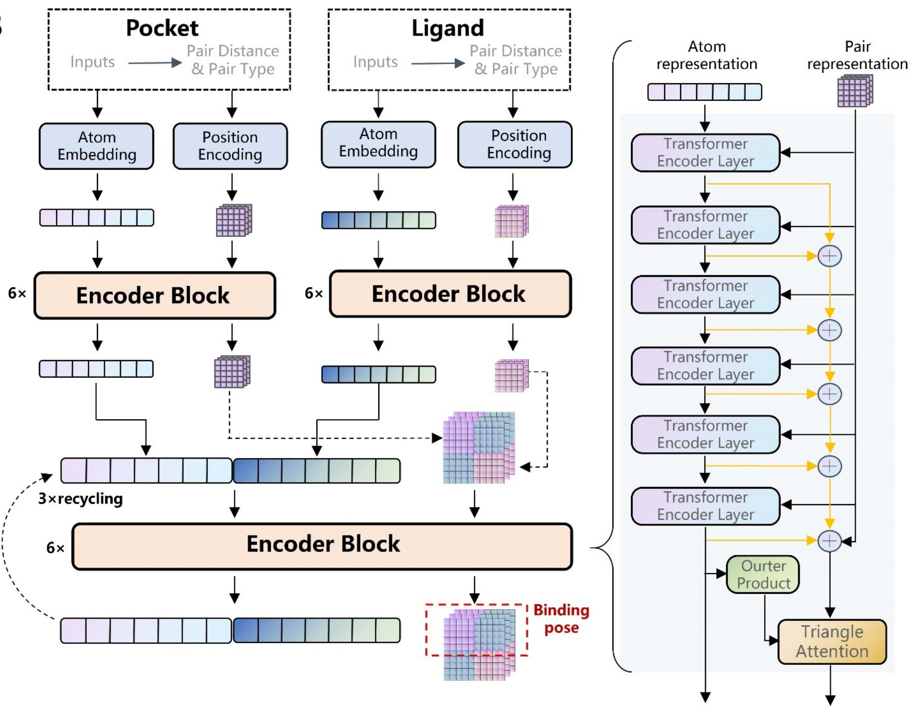

# CarsiDock
Official implementation of CarsiDock.



## Environment
We tested the code in the following docker environment on Tesla A100 GPU machine.
```shell
docker build -f DockerFile -t carsidock:v1 .
```

## Evaluate on PDBBind Core Set.
```shell
docker run -v ./:/Docking --gpus all carsidock:v1 python /Docking/run_core_set_eval.py --cuda_convert
```

## Docking
```shell
# redocking
docker run -v ./:/Docking --gpus all carsidock:v1 python /Docking/run_docking_inference.py --pdb_file example_data/4YKQ_hsp90_40_water.pdb --sdf_file example_data/4YKQ_hsp90_40.sdf --cuda_convert

# docking for decoys
docker run -v ./:/Docking --gpus all carsidock:v1 python /Docking/run_docking_inference.py --pdb_file example_data/4YKQ_hsp90_40_water.pdb --sdf_file example_data/4YKQ_hsp90_40.sdf --smiles_file example_data/smiles.txt --output_dir outputs/4ykq --cuda_convert
# The docking conformation will be stored in the outputs/4ykq folder with ${inchi_key}.sdf as the file name.
```

## Screening
The score table will be stored in the outputs/1qkt folder with score.dat as the file name. 
```shell
# sdf decoys
docker run -v ./:/Docking --gpus all carsidock:v1 python /Docking/run_screening.py --pdb_file example_data/1qkt_p.pdb --reflig example_data/1qkt_l.sdf --ligands example_data/1qkt_decoys.sdf --output_dir outputs/1qkt --cuda_convert

# smiles decoys
docker run -v ./:/Docking --gpus all carsidock:v1 python /Docking/run_screening.py --pdb_file example_data/1qkt_p.pdb --reflig example_data/1qkt_l.sdf --ligands example_data/smiles.txt --output_dir outputs/1qkt --cuda_convert
```


## License
The code of this repository is licensed under [GPL-3.0](https://www.gnu.org/licenses/gpl-3.0.en.html). The use of the CarsiDock model weights is subject to the [Model License](./MODEL_LICENSE.txt). CarsiDock weights are completely open for academic research, please contact [bd@carbonsilicon.ai](bd@carbonsilicon.ai) for commercial use. 

## Checkpoints

If you agree to the above license, please download checkpoints from the following link and put them in the ``checkpoints`` folder.

Carsidock: [GoogleDrive](https://drive.google.com/file/d/1OweBn07R4bpoC0gETezKrOoK7xYreO4O/view?usp=drive_link)/[飞书](https://szuy1h04n8.feishu.cn/file/C3uqbkc6UoNI6kxsw2Ycg8cOnnf?from=from_copylink) 

RTMScore: [GitHub](https://github.com/sc8668/RTMScore/raw/main/trained_models/rtmscore_model1.pth)

## Copyright
[CarbonSilicon.AI](https://carbonsilicon.ai/) All rights reserved.
