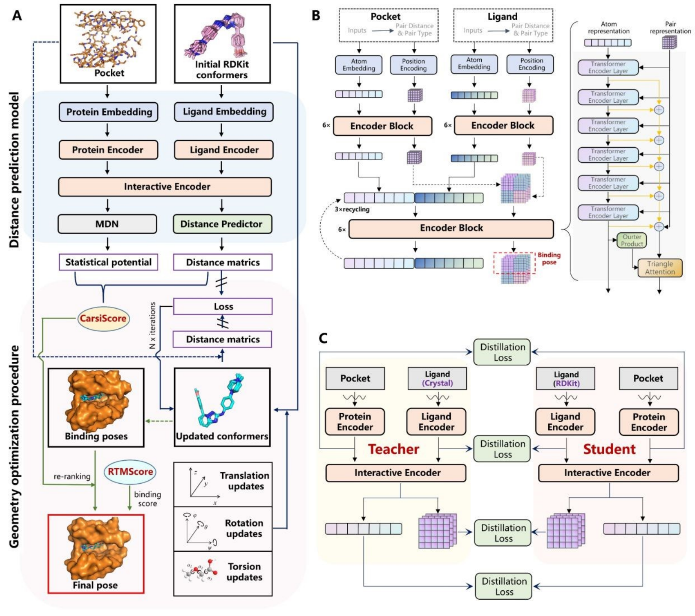

# CarsiDock
Official repo of CarsiDock proposed by CarbonSilicon AI.



## Environment
We tested the code in the following docker environment on Tesla A100 GPU machine.
```shell
docker build -f DockerFile -t carsidock:v1 .
```

## Evaluate on PDBBind Core Set.
```shell
docker run -v ./:/Docking --gpus all carsidock:v1 python /Docking/run_core_set_eval.py --cuda_convert
```

## Docking
```shell
# redocking
docker run -v ./:/Docking --gpus all carsidock:v1 python /Docking/run_docking_inference.py --pdb_file example_data/4YKQ_hsp90_40_water.pdb --sdf_file example_data/4YKQ_hsp90_40.sdf --cuda_convert

# docking for decoys
docker run -v ./:/Docking --gpus all carsidock:v1 python /Docking/run_docking_inference.py --pdb_file example_data/4YKQ_hsp90_40_water.pdb --sdf_file example_data/4YKQ_hsp90_40.sdf --smiles_file example_data/smiles.txt --output_dir outputs/4ykq --cuda_convert
# The docking conformation will be stored in the outputs/4ykq folder with ${inchi_key}.sdf as the file name.
```

## Screening
The score table will be stored in the outputs/ace folder with score.dat as the file name. 
```shell
# sdf decoys
docker run -v ./:/Docking --gpus all carsidock:v1 python /Docking/run_screening.py --pdb_file example_data/ace_p.pdb --reflig example_data/ace_l.sdf --ligands example_data/ace_decoys.sdf --output_dir outputs/ace --cuda_convert

# smiles decoys
docker run -v ./:/Docking --gpus all carsidock:v1 python /Docking/run_screening.py --pdb_file example_data/ace_p.pdb --reflig example_data/ace_l.sdf --ligands example_data/smiles.txt --output_dir outputs/ace --cuda_convert
```


## License
The code of this repository is licensed under [GPL-3.0](https://www.gnu.org/licenses/gpl-3.0.en.html). The use of the CarsiDock model weights is subject to the [Model License](./MODEL_LICENSE.txt). CarsiDock weights are completely open for academic research, please contact <bd@carbonsilicon.ai> for commercial use. 

## Checkpoints

If you agree to the above license, please download checkpoints from the following link and put them in the ``checkpoints`` folder.

Carsidock: [GoogleDrive](https://drive.google.com/file/d/1OweBn07R4bpoC0gETezKrOoK7xYreO4O/view?usp=drive_link) / [飞书](https://szuy1h04n8.feishu.cn/file/C3uqbkc6UoNI6kxsw2Ycg8cOnnf?from=from_copylink) 

RTMScore: [GitHub](https://github.com/sc8668/RTMScore/raw/main/trained_models/rtmscore_model1.pth)

## Copyright
[CarbonSilicon.AI](https://carbonsilicon.ai/) All rights reserved.

## Citation
If you find our work helpful, please consider citing.
```
@Article{D3SC05552C,
author ="Hou, Tingjun and Cai, Heng and Shen, Chao and Jian, Tianye and Zhang, Xujun and Chen, Tong and Han, Xiaoqi and Yang, Zhuo and Dang, Wei and Hsieh, Chang-Yu and Kang, Yu and Pan, Peichen and Ji, Xiangyang and Song, Jianfei and Deng, Yafeng",
title  ="CarsiDock: a deep learning paradigm for accurate protein-ligand docking and screening based on large-scale pre-training",
journal  ="Chem. Sci.",
year  ="2024",
pages  ="-",
publisher  ="The Royal Society of Chemistry",
doi  ="10.1039/D3SC05552C",
url  ="http://dx.doi.org/10.1039/D3SC05552C",
abstract  ="The expertise accumulated on deep neural networks-based structure prediction has been widely transferred to the field of protein-ligand binding pose prediction{,} thus leading to the emergence of a variety of deep learning-guided docking models for predicting protein-ligand binding poses without relying on heavy sampling. However{,} their prediction accuracy and applicability are still far from satisfaction{,} partially due to the lack of protein-ligand binding complex data. To this end{,} we create a large-scale complex dataset containing ~9M protein-ligand docking complexes for pre-training{,} and propose CarsiDock{,} the first deep learning-guided docking approach that leverages pre-training of millions of predicted protein-ligand complexes. CarsiDock contains two main stages{,} i.e.{,} a deep learning model for the prediction of protein-ligand atomic distance matrices{,} and a translation{,} rotation and torsion-guided geometry optimization procedure to reconstruct the matrices into a credible binding pose. The pre-training and multiple innovative architectural designs facilitate the dramatically improved docking accuracy of our approach over the baselines in terms of multiple docking scenarios{,} thereby contributing to its outstanding early recognition performance in several retrospective virtual screening campaigns. Further explorations demonstrate that CarsiDock can not only guarantee the topological reliability of the binding poses but also successfully reproduce the crucial interactions in crystalized structures{,} highlighting its superior applicability."}
```
